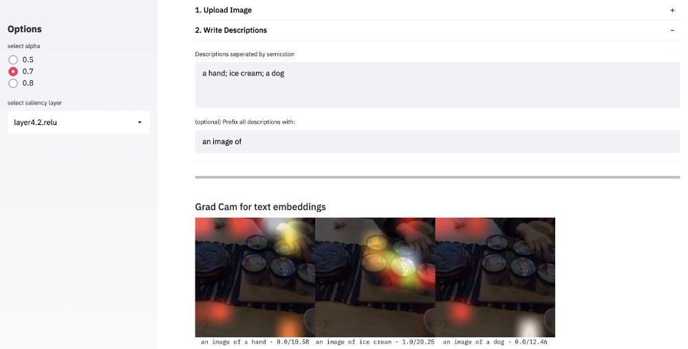
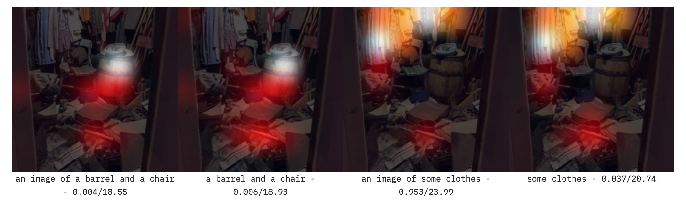
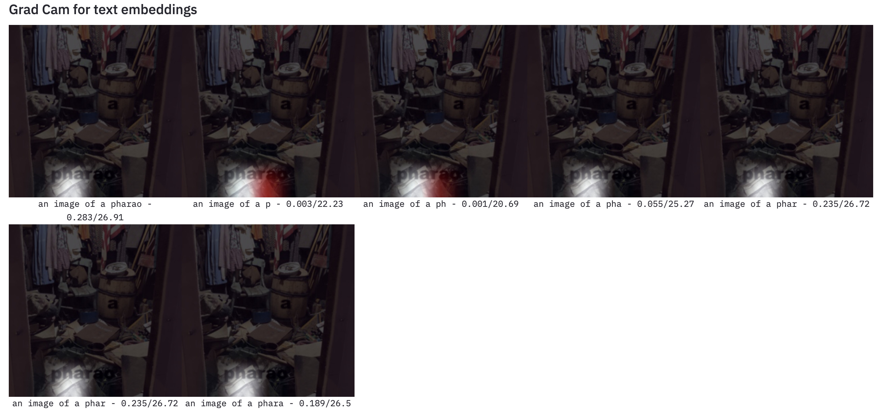
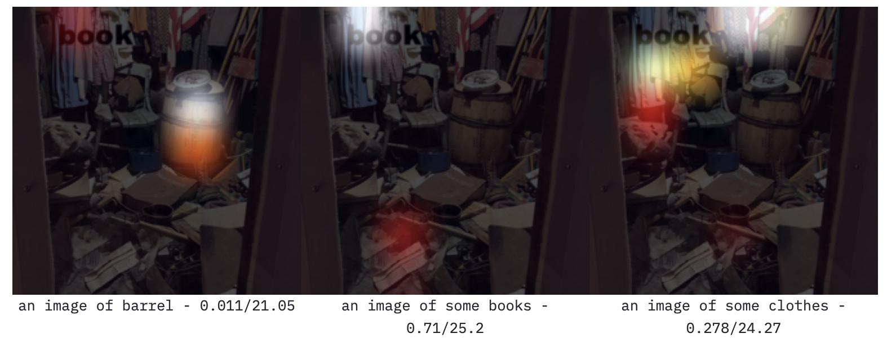

## MiniClip: A quick demo to explore text descriptions and saliency maps with Clip models




This demo app uses the [OpenAI Clip](https://github.com/openai/CLIP) (Resnet50) model. You can upload an image and test your text descriptions to observe:

1. How similar are the embeddings of your descriptions to the image embeddings under the Clip model?
2. What is the salience map when using the text-embeddings of your descriptions as logits for the image model part of Clip?

By playing around with the demo several observations can be made that enable more tangible access to the clip model.

### Insight: Descriptions are not labels
Recently, a use case for Clip was established to use the model as a zero-shot classification model. But when you are in control of the description text it will become obvious how much closer the relation to language models is. Synonyms or properties of objects have a similar response in the text embeddings which leads to a similar probability. The examples below show how "wood" and "barrel" seem to trigger a similar response - not only in logits/softmax but also in saliency. 

The room below is full of items that all can be identified by saliency maps. Even describing material  ("wood") points at the right items ("barrel"):


In the example below, you can see how well saliency captures the objects of interest. Even abstract descriptions like "covid 19 protection" seem to point towards the mask of the person in front. 


### Insight: A prime/prefix can influence results
Using a prime like "an image of" can increase the similarity of close descriptions and image embeddings and decrease similarity for descriptions that are off. See the following book example. 

Surprisingly, the phrase "an image of a book" does not match the image embedding. This aligns with our human understanding of the phrase. We would expect a more prototypical image of a book rather than a book as one item in a complex room scene. 

### Insight: Text adversaries are dominant
Text on top of an image is very dominant which is also reflected in the saliency maps. In the following example, we observe a very strong focus on the word "pharao" which is completely out of the image context. Even small sub-phrases, like "ph" or "pha" already guide the saliency strictly towards the text label.


Here is another example to see how dominant text is even in presence of visual objects of the same type in a scene image:



## It's fun. Try it for yourself
Trying to uncover how visual and textual embeddings merge into one amalgamation of modalities can be truly fascinating. Please try the demo on your GPU machine.

### Installation
TBD


## Author, Cite, and Thanks
Demo and text are created by [Hendrik Strobelt](http://hendrik.strobelt.com) who is the Explainability Lead at the [MIT-IBM Watson AI Lab](https://mitibmwatsonailab.mit.edu/). Thanks go to David Bau who helped through great conversations.

Please cite if you used this demo to get novel ideas:
```
@misc{HenMiniClip2021,
  author = {Strobelt, Hendrik},
  title = {MiniClip},
  year = {2021},
  publisher = {GitHub},
  journal = {GitHub repository},
  howpublished = {\url{https://github.com/HendrikStrobelt/miniClip}}
}
```
