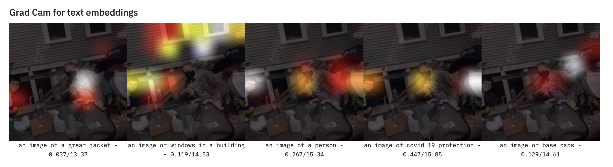

## A quick demo to explore saliency maps with Clip models

This demo app uses the [OpenAI Clip](https://github.com/openai/CLIP) (Resnet50) model.
You can upload an image and test several text descriptions to see:

1. How similar are the embeddings of your descriptions for the image under the ResNet50 model?
2. What is the salience map when using the text-embeddings as "logits" for the image model?

### Example Observations
By playing around with the demo several obseravtions can be made that enable a more tangible access to the clip model.

#### Descriptions are not labels
Recently, a use case for Clip established to use the model as a zero-shot classification model. This is amazing to observe but when you are in control of the description text it will become obvious how close the relation to language models is. Synonyms or properties of objects have a similar response in the embedding. The examples below show how "wood" and "barrel" seem to trigger a similar response - not only in logits/softmax but also in saliency. 

#### The right primer/prefix can have influence on the results
A common observationis is that using a primer like "an image of" can increase the similarity of close descriptions and image embeddings and decrease similarity for descriptions that are off. 

#### It's fun. Try it for yourself
Trying to uncover how visual and textual embeddings merge into one amalgation of modalities is truly fascinating. Please feel free to checkout the repo and try the demo on your GPU machine. 

## Thanks
Thanks go to David Bau who helped through great conversations.
